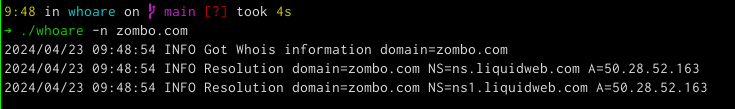

# WhoAre

A WhoIs based A record lookup tool.

## Audience

If you've ever needed to parse the output of whois, grab the nameservers,
and then query each one to verify that they are in consensus over where they
point, then this tool is for you.
